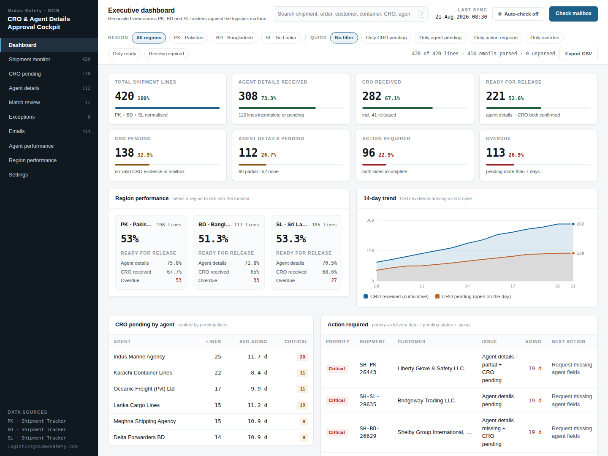
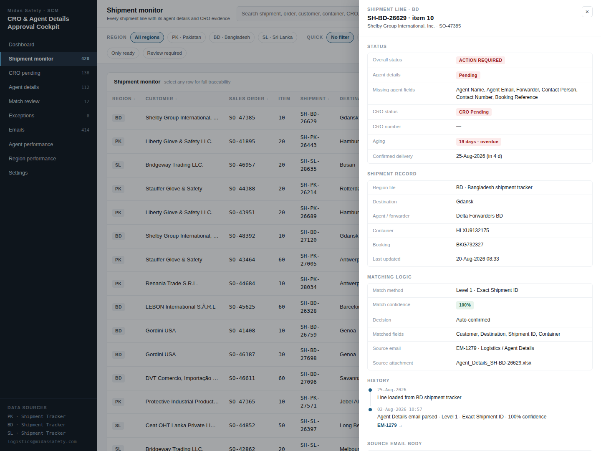

# CRO & Agent Details Approval Cockpit

Reconciles the three regional shipment trackers (PK / BD / SL) against the
logistics mailbox and answers one question for supply-chain planning: **which
shipment lines can be released today, and who is holding up the rest?**

A line is releasable only when the forwarder has supplied complete agent
details *and* a Container Release Order has been received. The cockpit parses
the mailbox, matches each email back to a shipment line, and shows what is
still missing, how long it has been waiting, and which forwarder owns it.

Grown out of a Claude Design canvas prototype into a running application: no
canvas runtime, no framework, no build dependencies.



## Running it

```bash
npm run dev      # serves the module sources at http://localhost:4173
npm run build    # bundles to dist/cro-cockpit.html (open it from disk)
npm test         # builds, then drives dist/ in headless Chromium (28 checks)
```

`npm test` needs Playwright (`npm install`). Development needs a static server
rather than `file://` because the sources are ES modules; the built file has no
such constraint.

## Views

| View | What it answers |
|---|---|
| **Dashboard** | Eight KPIs, region comparison, 14-day CRO trend, worst agents, the priority work queue, aging of open lines |
| **Shipment monitor** | Every line with its evidence — sortable, paged, deep-linkable |
| **CRO pending** / **Agent details** | The monitor pre-filtered to each half of the release rule |
| **Match review** | Matches below the confidence threshold — confirm or reject each one |
| **Exceptions** | Emails no line could be found for; link one to a shipment by hand |
| **Emails** | Every parsed email and the fields extracted from it |
| **Agent performance** | Forwarder-wise CRO turnaround, pending exposure, rating |
| **Region performance** | PK / BD / SL comparison and aging distribution |
| **Settings** | Policy thresholds, mailbox behaviour, theme |

Any row opens a drawer with the full trace: status, shipment record, how the
match was made, the line's history, and the source email body.



## Running it on the real trackers

The app ships with a seeded demo dataset so it works out of the box. Point it at
the real regional trackers and it switches to live mode:

```bash
python3 tools/import_trackers.py \
    Shipment_TrackerPKREGION.xlsx Shipment_TrackerMSBD.xlsx Shipment_TrackerSLREGION.xlsx \
    -o src/dataset.json
npm run dev
```

The importer reads each workbook's regional sheet (header on row 4), normalises
it, and prints everything it had to correct — the cleanup is reported, never
silent. In live mode the mailbox views (Emails, Match review, Exceptions) are
hidden, since no mailbox is connected, and the dashboard gains the value of what
is blocked.

Two things the trackers do not carry, and the app does not pretend otherwise:
there is no forwarder column, so lines are ranked by their **area account
manager**; and "overdue" means the **confirmed delivery date has passed**, not a
desk-aging rule — with real data every line ages in months.

> `src/dataset.json` is gitignored. It contains customer names, prices and order
> values, and **this repository is public.** Keep extracts out of it.

## Business rules

Encoded in one place, `src/rules.js`, and tunable at runtime from Settings:

- **Status matrix** — `agentStatus × croStatus → overall status`
  (READY, RELEASED, CRO PENDING, AGENT DETAILS PENDING, ACTION REQUIRED).
- **Review threshold** (default 70%) — matches below it go to the review queue
  instead of silently updating a line.
- **Auto-confirm** (default 90%) — at or above it the parser accepts a match
  without a human.
- **Overdue** (default 7 days) — a pending line past this counts as overdue and
  as a critical against its forwarder.
- **Match ladder** — exact shipment ID → sales order → customer + shipment →
  container → booking/BL → fuzzy. Each level carries its own confidence.
- **Priority** — delivery pressure first (`daysToDelivery`), then aging, then
  whether both sides of the rule are incomplete.

## How it is put together

```
index.html          dev entry (ES modules)
build.js            inlines everything into dist/ — no bundler dependency
src/rules.js        business rules, reference data, status/priority helpers
src/data.js         seeded dataset + the mailbox parsing loop
src/store.js        state, filters, derived metrics, actions, URL routing
src/dom.js          h() / mount() — ~60 lines instead of a framework
src/charts.js       trend line chart and aging distribution (hand-built SVG)
src/views/*.js      one module per view; every view is a function of state
test/ui.test.mjs    end-to-end checks against the built file
```

State lives in `src/store.js` and nowhere else. Views read from it and re-render
whole; at this data volume that is cheaper than diffing, and it keeps each view
a pure function of state. Filters, the active view and the page number live in
the URL, so a filtered screen can be pasted into a message. Policy settings and
reviewer decisions persist in `localStorage`.

The dataset is deterministic (seeded), so the same 420 lines and 414 emails
appear on every load and screenshots stay comparable. **Check mailbox** drains a
queue of unread mail: most emails advance a line, some come in below the
confidence threshold and land in the review queue, and a few fail to parse and
land in Exceptions.

## Design

- **Light and dark are both designed**, token-level, and the un-stamped
  "system" state resolves correctly — nothing is defined only inside a
  `[data-theme]` block.
- **Chart colours are validated, not eyeballed.** The two series
  (`#1668a0` / `#c0642a` light, `#3f8fc6` / `#d47a35` dark) clear the CVD
  separation, chroma, lightness-band and contrast checks in both modes; status
  colours are reserved for state and never reused as a series.
- **One axis, always.** Received and pending are the same unit, so they share a
  scale; the aging distribution is a single-hue ordinal ramp, labelled in place
  so the reading never depends on hue alone.
- Every row, chip and control is a real button, reachable by keyboard.
  `/` focuses search, `Esc` closes the drawer or clears the search.

## What changed from the prototype

The canvas prototype rendered the screens. This turns them into an application:

- **Working charts** — the trend was two stacked bars of unrelated measures
  (which reads as a total that means nothing); it is now a dual-series line
  chart with a crosshair, tooltips and end labels, and the values are *derived*
  from the data rather than generated by a random number generator.
- **The tables work** — sortable columns, paging (the prototype cut off at 60
  rows with no way to see the rest), and a CSV export that covers every filtered
  line with a readable header.
- **Review decisions do something** — confirm now advances the line and
  recomputes its status; reject unlinks the evidence and sends the email to
  Exceptions. Previously both only painted a label.
- **Exceptions is new** — unparsed mail was counted but unreachable; it is now a
  view where a planner links the email to a line by hand.
- **Settings is new** — the thresholds were canvas-editor knobs, so nobody
  running the app could reach them.
- **Filters are honoured everywhere** — agent aggregation ignored the active
  filters and always reported on all 420 lines.
- **Lines with no evidence stop claiming a match method** and no longer report a
  confidence they never earned.
- Deep links, persistence, a dark theme, keyboard support, an audit trail per
  line, chase-email drafting, and an end-to-end test suite.
