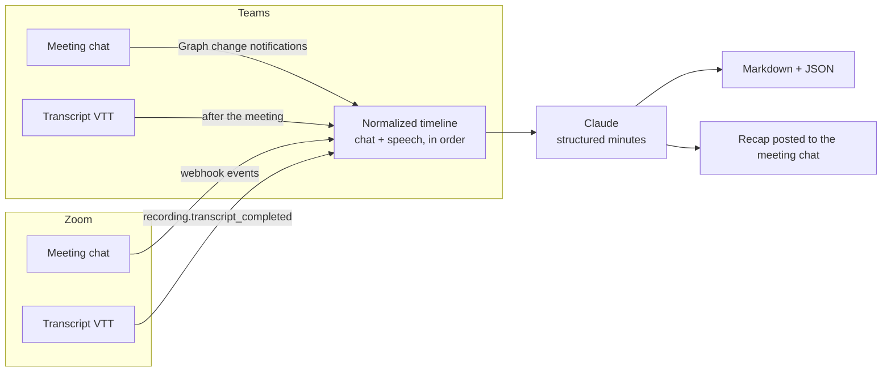

# Meeting Minutes Agent

Reads what happens in a Microsoft Teams or Zoom meeting — the typed meeting chat
and the spoken transcript — and writes the minutes: summary, decisions, action
items with owners, open questions, and risks.

Chat and speech are merged into a single time-ordered record before anything is
summarized, which is the point of the whole thing: the decision is usually
announced out loud, and the PO number, the figure, and the link land in chat.
Either source alone produces minutes with holes in them.



## What it captures, per platform

| | Microsoft Teams | Zoom |
| --- | --- | --- |
| Chat, during the meeting | Yes — Graph change notifications on the meeting chat (polling fallback) | Yes — `meeting.chat_message_sent` webhook |
| Participants joining/leaving | From the online meeting record | Yes — participant webhooks |
| Speech | After the meeting — Graph transcript (VTT) | After the meeting — cloud recording transcript (VTT) |
| Backfill of a past meeting | `mma teams-poll` | `mma zoom-import` |

Neither platform exposes live captions to an app-only integration, so **speech
arrives after the meeting ends, not during it**. The agent handles this by
waiting `MMA_TRANSCRIPT_GRACE_SECONDS` after the meeting-ended event before
writing up, and by regenerating when the transcript event lands later.

## Quick start

```bash
pip install -e ".[dev]"
cp .env.example .env          # add ANTHROPIC_API_KEY at minimum
export PYTHONPATH=src         # or rely on the installed `mma` entry point

# Generate minutes from the bundled sample meeting - no Teams/Zoom needed
mma minutes --file examples/sample_meeting.json
```

That writes `out/zoom-sample-planning-review.md` (human-readable) and `.json`
(the same minutes as structured data, for a ticketing system or a dashboard).

Then run the server and point the platforms at it:

```bash
mma serve --port 8000
```

| Endpoint | Purpose |
| --- | --- |
| `POST /webhooks/zoom` | Zoom events + the URL-validation handshake |
| `POST /webhooks/teams` | Graph change notifications for a meeting chat |
| `GET /meetings` | Meetings captured so far |
| `GET /meetings/{key}` | One meeting with its captured timeline |
| `POST /meetings/{key}/minutes` | Generate minutes now |
| `GET /healthz` | Liveness, and which platforms are configured |

The webhook URL must be reachable from the internet over HTTPS. For local
development, tunnel it (`ngrok http 8000`) and use the tunnel URL.

## Setting up Microsoft Teams

1. Register an app in Entra ID (Azure AD) → note the tenant id, client id, and a
   client secret.
2. Grant **application** permissions in Microsoft Graph and have an admin consent
   to them:
   - `ChatMessage.Read.All` — read meeting chat
   - `OnlineMeetings.Read.All` — resolve the meeting and its chat thread
   - `OnlineMeetingTranscript.Read.All` — read the transcript
   - `ChatMessage.Send` — only if you want the recap posted back to the chat
3. **Meeting chat and transcript APIs are protected APIs.** Microsoft requires a
   separate access request before app-only calls to them succeed in a production
   tenant; the app registration alone is not enough. Apply through the Microsoft
   Graph protected-API request form for your tenant.
4. Fill in `TEAMS_*` in `.env`, including a long random
   `TEAMS_SUBSCRIPTION_CLIENT_STATE` — every notification is checked against it,
   and mismatches are rejected with a 401.
5. Subscribe to a meeting's chat:

   ```bash
   mma teams-subscribe --chat-id "19:meeting_xxx@thread.v2"
   ```

   Subscriptions to chat messages expire after an hour. Graph sends a
   `reauthorizationRequired` lifecycle notification before that, and the server
   renews automatically on receipt.

Subscriptions are created **without resource data**, so no certificate or
payload decryption is needed: the notification carries the resource path and the
agent fetches the message over Graph.

Transcripts are per online meeting, so attach them explicitly once the meeting
is done:

```bash
mma teams-poll --chat-id "19:meeting_xxx@thread.v2" --meeting-id "MSo...=="
```

## Setting up Zoom

1. Create a **Server-to-Server OAuth** app in the Zoom Marketplace → note the
   account id, client id, and client secret.
2. Add scopes: `meeting:read`, `report:read:admin` (participants), and
   `cloud_recording:read` (transcript). Chat events also require the in-meeting
   chat event scope on the app's event subscription.
3. Add an event subscription pointing at `https://your-host/webhooks/zoom` and
   enable:
   - `meeting.started`, `meeting.ended`
   - `meeting.participant_joined`, `meeting.participant_left`
   - `meeting.chat_message_sent`
   - `recording.transcript_completed`
4. Copy the app's **Secret Token** into `ZOOM_WEBHOOK_SECRET_TOKEN`. Every event
   is verified against `x-zm-signature` over the raw request body; unsigned or
   tampered events are rejected with a 401. Zoom's validation handshake is
   answered automatically when you click "Validate".
5. Transcripts require cloud recording with audio transcript switched on in
   account settings — without it, `recording.transcript_completed` never fires
   and the minutes are built from chat alone.

To write up a meeting the agent did not watch live:

```bash
mma zoom-import --meeting-id "<meeting id or UUID>"
mma minutes --session zoom-<meeting-id>
```

## Privacy and consent

Recording and summarizing a meeting is a consent matter before it is a technical
one. Announce the agent at the start of the meeting and follow whatever your
jurisdiction and company policy require — this repo does not do that for you.

Two in-meeting controls are built in, both driven by what people type in chat:

| Typed in chat | Effect |
| --- | --- |
| `/nominutes` or `#offrecord` | Everything that person contributed is dropped before summarization |
| `#private` | That single message is dropped |

Both marker lists are configurable (`MMA_OPT_OUT_MARKERS`, `MMA_IGNORE_MARKERS`).
Filtering happens in `timeline.py`, before any text reaches the model.

Captured meetings are stored as plain JSON under `MMA_DATA_DIR` and minutes under
`MMA_OUTPUT_DIR`. Both are gitignored. Set a retention policy appropriate to your
organization — the agent does not delete anything on its own.

## How the minutes are generated

`minutes/generator.py` calls Claude with a Pydantic schema as the structured
output format, so the response is always a valid `Minutes` object rather than
prose to be parsed. The system prompt is cached across calls.

Short meetings go through in one call. Long ones are split on utterance
boundaries into overlapping slices, each extracted into `ChunkNotes`, then
reduced into the final minutes — so a three-hour meeting doesn't depend on one
pass over the whole record. The threshold is `MMA_CHUNK_CHARS` (default 40,000
characters, roughly 10k tokens per slice).

The prompt is explicit about the things that make automated minutes untrustworthy:
every decision and action item carries a verbatim quote as evidence, unowned
commitments are marked `Unassigned` rather than attributed to a guess, and
unresolved disagreements are recorded as open questions rather than decisions.

## Configuration

All settings come from the environment (or `.env`). See `.env.example` for the
full list; the ones you are most likely to change:

| Variable | Default | Purpose |
| --- | --- | --- |
| `MMA_MODEL` | `claude-opus-5` | Model used for generation |
| `MMA_CHUNK_CHARS` | `40000` | Slice size before map-reduce kicks in |
| `MMA_TRANSCRIPT_GRACE_SECONDS` | `120` | Wait after meeting end before writing up |
| `MMA_POST_MINUTES_TO_CHAT` | `false` | Post a recap back into the Teams meeting chat |
| `MMA_DATA_DIR` / `MMA_OUTPUT_DIR` | `data` / `out` | Where sessions and minutes are written |

## Layout

```
src/meeting_minutes_agent/
  models.py            Normalized types: Utterance, MeetingSession, Minutes
  timeline.py          Merge chat + speech, apply opt-outs, slice for the model
  store.py             One JSON file per meeting, write-through
  vtt.py               WebVTT parsing (Teams voice spans and Zoom prefixes)
  agent.py             Event handling, transcript attachment, delivery
  server.py            FastAPI webhooks and REST
  cli.py               `mma` commands
  connectors/          teams.py (Microsoft Graph), zoom.py (REST + webhooks)
  minutes/             generator.py, prompts.py, render.py
```

## Tests

```bash
python -m pytest
```

46 tests, no network access required — the Claude client and both platform APIs
are stubbed. They cover VTT parsing for both platforms, chat/speech merging,
opt-out filtering, chunk boundaries, Zoom signature verification and the
validation handshake, Teams HTML flattening and clientState checks, webhook
capture and dedupe, and the map-reduce path through the generator.

## Known limits

- Speech is post-meeting on both platforms; there is no live transcription path
  for an app-only integration.
- Teams meeting chat and transcript APIs need Microsoft's protected-API approval
  in a production tenant.
- Zoom offers no app-only API for posting into a past meeting's chat, so the
  recap is delivered to the Teams chat, to files, or to whatever you wire up in
  `MinutesAgent.deliver`.
- Speaker attribution is only as good as the platform's — Zoom transcripts
  attribute by audio channel and misattribute in shared-room setups.
